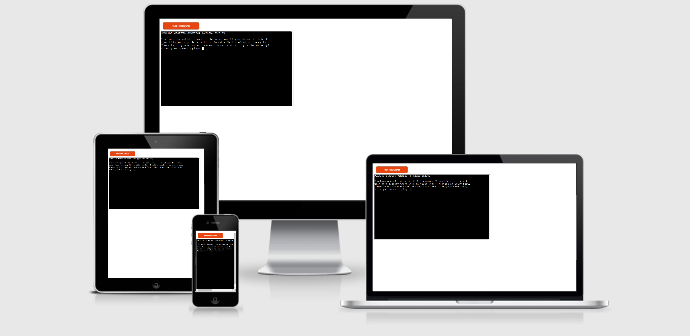
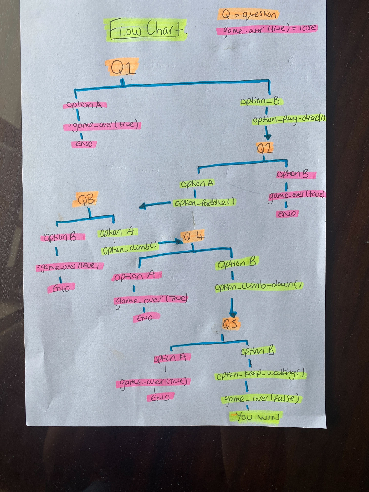
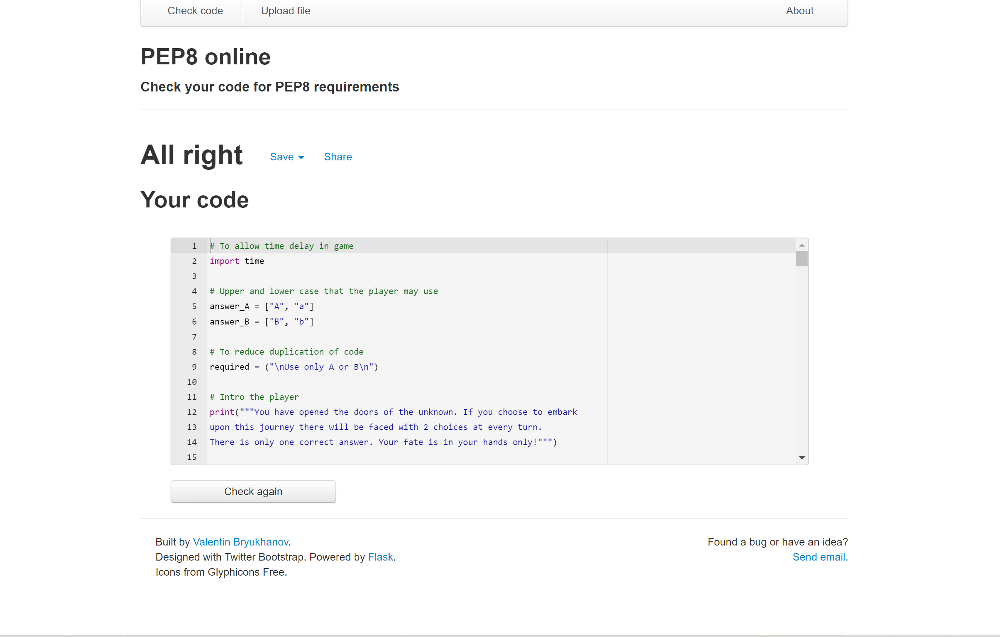

# What An Adventure - A Milestone Project

My third milestone project, undertaken as part of the Code Institutes Diploma in Software Development. 
Here is the link for [What An Adventure](https://whatanadventure.herokuapp.com/)

# Who Is This Game For?

This is a text-based adventure and has been designed for people that will enjoy using their imagination whilst playing a game. 
The aim behind this adventure game is to quickly build a scenario in the players mind followed by a quick "make your choice" style questions. A light-hearted game infused with a little humour. 

# User Goals 

To explore their way through some extreme scenarios with the goal of making it through each scenario. 
To make a choice when each scenario is presented and be able to express their choice easily. 
To avoid the pitfalls of making the wrong choice, would end the game and render them unsuccessful in their adventures.

# Owner Goals

To present small paragraphs of text to set the scenario before each question. 
To keep the player engaged and not make the game to complicated to play and tiresome to read. 
The owner believes that most gamers enjoy mental activity and stimulation and would rather avoid long paragraphs of text. 
Provide two choices after each scenario which is followed by the outcome of that choices. 
Keep the choice mechanism consistent for the player throughout the game allowing the player to be more engaged. 
Create a range if functions which will remain useful should the adventure be expanded in the future. 

# Narrative

What An Adventure leads the player through various scenarios that are certainly out of the ordinary and also extreme in nature. 
The game is intended to be playful and witty in its narration. The scenarios are do overlap slightly to maintain a continuation of the story in the game. However, the focus of the game is to keep the player engaged in the "new" scenario they are faced with, should they pass the previous successfully. Should the player make the wrong choice, they would have to play the game from the beginning. 

# Code Design

The functions of the game have been designed to provide reduce the amount of code that is repeated and also to make it much easier to expand to the story in the future by adding further scenario before the conclusion of the game is reached. 

# Story Functions 

- time.sleep - This function allowed a time delay of a few seconds before the options for the player pop up. This was implemented mostly to give the player a sense of forwards moving motion of the game. It also slows the speed at which information is presented to the player, thus allowing the player to digest the content at a better pace. 

- print - to display various texts throughout the game, including the story and the choices. 

- get_name() - This prompts the player to input their name and once entered is displayed in the welcoming statement that follows. 
- capitalize() / strip() - Added to the get name function so that any white spaces are removed and the name is capitalized when returned in the welcome statement. 

- game() - This function was defined to outline where the game begins and ends. Most functions of the game are played within this function. 

- if/else - A key function throughout the game as it provides the basis of an option to the player.

- get_response - The function was introduced following the testing of the game and was used to replace the elif function and therefore led to the reduction of the code. 
- While loop / Choice input - The choice input submerged within the while loop was also a late introduction and again reduced the need for repetitive code. The upper() and strip() functions follow the choice input function to address the need for a capitalized answer and also to remove any white saces surrounding the answer that would make it void. The while loop is imperative in prompting an acceptable response from the player by making them aware that they need to select either "A" or "B". 

- option_play_dead / option_paddle() / option_climb() / option_climb_down() / option_keep_walking() - These functions all follow on from the player making the correct choice and lead them to the next question. These functions prevent the code from becoming nested as each function leads the player to the next (provided they have given the correct answer). 

- game_over(True) - Placed under each incorrect response and leads to a display of text telling the player that they have lost the game. 

- game_over(false) - This function leads to a display of text telling the player that they have one the game. 

# Planning

Below is a link to the flowchart I had completed prior to building the application to allow me to visualize the execution of the code and to outline some of the functions that would be required. 

# Technologies used
 
- [Github]( https://github.com/) to keep the file 
- [Gitpod]( https://www.gitpod.io/) for version control

# Languages used

- [Python](https://en.wikipedia.org/wiki/Python_(programming_language))

# Resources
- [Code Institute](https://codeinstitute.net/) Course material
- [Code Institute](https://codeinstitute.net/) Slack community 
- [W3Schools]( https://www.w3schools.com/) Helped with understanding certain python code
- [PEP8](http://pep8online.com/) Validate python code for the game
- [Am I Responsive](http://ami.responsivedesign.is/) Check site deployment and for header image of this README file
- [Stack Overflow](https://stackoverflow.com/) Very helpful for troubleshooting issues I had with the code along the way

# Python Libraries 

- [Time](https://docs.python.org/3/library/time.html) Enables the delay of a few seconds before presenting the options to the player to make their selection after the scenario has been set. 

# Testing
The game was tested throughout the build. Initially I had trouble getting the game to execute as there was a lot of issues with indentation and white spaces. As this is my first python application, I was not aware of just how sensitive python can be. 
A further issue that cropped up was the game ending when an invalid response was submitted. This led to the introduction of the while loop that made it necessary for the response to be acceptable for the game to progress. 
Another major issue was that the code had become very nested, and it was becoming difficult to maintain. It also would have caused issues with expanding the game in the future. The nested code was replaced with functions in the end that led the code out of the previous loop and therefore avoided the code from becoming nested whilst also reducing code repetition. 

# Future Features 

Due to time constraints, I was not able to explore all the features that I had wanted to include. 
There is plentiful scope for how this game can be expanded in the future. Aside the obvious option of adding more scenarios and thus expanding the game; I would potentially want to create a fork in the game leading to multiple paths, of which most eventually lead to the player losing. This would make the game more challenging to win as it would take the player longer to discover where they went wrong. 
Additionally, I would like to add some more scope to the functionality of the game, by allowing the player to pick up an object along the way. Another feature I would be interested in adding would be giving the player a success score, depending on how far they made it through the game. 

# Validator

I ran the code for the application through the PEP8 validator to ensure that it was free of bugs and will run smoothly once deployed. 
The code is completely free of any issues. 

# Version Control 

- GitHub
- Gitpod

Gitpod served as the local repository and IDE. 
GitHUb served as the remote repository. 

The following steps were followed to maintain version control;

- I created a repository on GitHub and named it 'What An Adventure' 
- I then signed in to Gitpod and opened a new workspace via the repository name 'What An Adventure'
- I created the pages and files on GitPod
- I saved my work on GitPod at regular intervals and pushed it to GitHub to keep it safe

This is the process I followed having completed each significant section of code, I typed the following into the terminal:
- git add . (This added the work to git)
- git commit -m "COMMIT MESSAGE" (This committed the work)
- git push (This pushed the work to GitHub)

# Deployment 

## Deployment to Heroku

- Log into Heroku (You will need to create an account if you do not have one)
- Click on the button labelled "New" from the dashboard. This is located in the right-hand corner, just under the header.
- Select "Create new app"
- Enter a name for the application. This name must be original. Choose the correct region and click "Create App".
- On the project page, select the "settings" tab. 
- Then select "config Vars" and enter the following details in the corresponding fields: 
    Key = PORT
    Value = 8000
- Select the "Add" button, this will add the Convig Vars. 
- Scroll to the buildpacks section and selects "Add Buildpacks"
- Add the Python buildpack.
- Add the node.js buildpack.
- It is important to ensure that the Python buildpack is listed above the node.js buildpack.
- At the top of the page there is a "Deploy" tab that must be selected. 
- Select the Github deployment method.
- Search for your repository name, then click the "Connect" button to link your repository.
- At the bottom of this page, select the deployment type. This can be automatic or manual. Automatic Deployment will redeploy the project to Heroku every time it is pushed to GitHub. I chose manual. The project is deployed. 

# Credits

I would like to thank [Code institute](https://slack.com/intl/en-gb/) for enabling me to be able to complete this project through their learning material. The slack group community was very helpful and plentiful in providing guidance and direction when needed. 
I would like to thank my mentor, Spencer Barriball. I have much respect for Spencer's knowledge and experience and truly appreciate his guidance and support throughout this project. 
